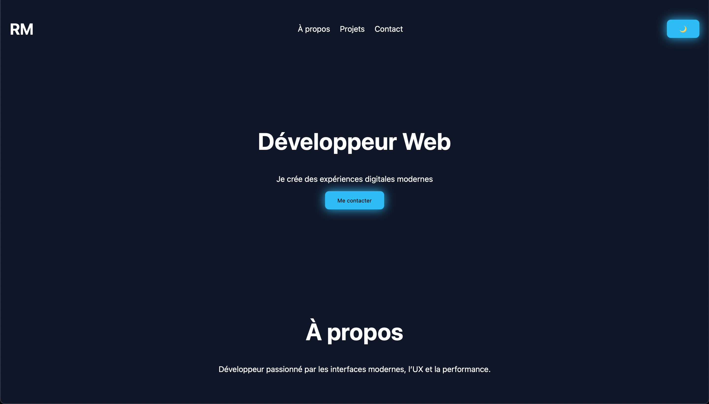

# 🚀 Web Developer Portfolio – Landing Page

> ⚡ Personal project built as part of my web development learning journey

## 📌 Description
This project is a modern portfolio landing page built to practice front-end development and create a clean, interactive user interface.

The goal was to design a responsive and visually appealing website with smooth animations and modern UI effects inspired by startup and Apple-style websites.

---

## 🎯 Project Goals
- Build a modern and responsive landing page
- Improve user experience (UX)
- Implement dynamic animations using JavaScript
- Structure a web project professionally

---

## 🛠️ Technologies Used
- HTML5
- CSS3 (variables, responsive design, animations)
- JavaScript (DOM manipulation, events, animations)

---

## ⚙️ Features
- 🌙 Dark / Light mode toggle
- 📱 Fully responsive design (mobile, tablet, desktop)
- 🍔 Mobile navigation menu
- ✨ Scroll animations (fade-in)
- ⌨️ Typing text effect
- 🔄 Page loader animation
- 🎨 Modern UI effects (glassmorphism, hover effects)

---

## 📷 Preview

---

## 🔗 Live Demo
👉 https://rmaloberti.github.io/site-vitrine/

---

## 💡 What I Learned
- DOM manipulation with JavaScript
- Event handling
- Creating smooth animations
- Using CSS variables
- Building responsive layouts
- Improving user experience (UX)

---

## 🚧 Possible Improvements
- Add a working contact form (backend)
- Connect to an API (GitHub, weather, etc.)
- Add dynamic projects section
- Improve performance
- Enhance accessibility

---

## 👨‍💻 Author
MALOBERTI Rémi

---

## 📬 Contact
📧 r.maloberti@yahoo.com